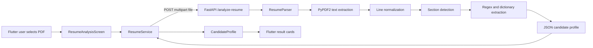
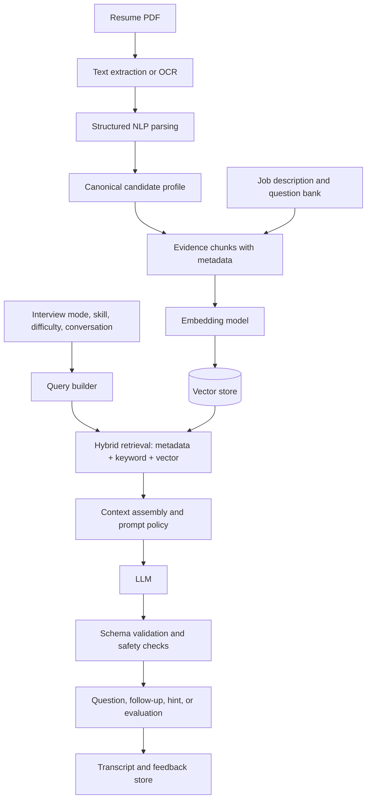

# AI/ML Features

This document describes the AI and machine-learning behavior currently present in AI Recruiter, the complete resume-analysis data flow, and the RAG/NLP architecture needed to turn the planned interview modes into grounded AI interviews.

## Executive Summary

The current implementation has one working AI-adjacent capability: PDF resume text extraction followed by deterministic, rule-based information extraction. It produces a structured candidate profile containing:

- Candidate name
- Skills
- Projects
- Education
- Experience

The implementation does **not** currently use a trained machine-learning model, large language model (LLM), NLP library, embeddings, a vector database, semantic search, RAG, speech recognition, question generation, scoring, or recommendation algorithms. The home screen advertises resume, skill-based, and hybrid interviews, but only the resume-analysis screen is wired to a working backend endpoint; the other interview and history surfaces are placeholders.

## Current Architecture



Relevant implementation files:

- [backend/services/resume_parser.py](backend/services/resume_parser.py): all resume extraction logic.
- [backend/routes/resume.py](backend/routes/resume.py): upload validation and API error handling.
- [backend/main.py](backend/main.py): FastAPI application and route registration.
- [lib/features/interview/data/resume_service.dart](lib/features/interview/data/resume_service.dart): Flutter multipart upload and response parsing.
- [lib/features/interview/presentation/resume_analysis_screen.dart](lib/features/interview/presentation/resume_analysis_screen.dart): file selection, loading state, and result display.
- [lib/features/interview/domain/candidate_profile.dart](lib/features/interview/domain/candidate_profile.dart): client-side profile schema.

## Implemented Resume Pipeline

### 1. File selection and request creation

The Flutter client uses `file_picker` and restricts selection to PDF files. After a file is selected, `ResumeService.analyzeResume` creates a multipart `POST` request to `/analyze-resume`.

The backend URL is selected by platform in [lib/core/constants/api_config.dart](lib/core/constants/api_config.dart):

- Android emulator: `http://10.0.2.2:8000`
- iOS simulator and desktop: `http://localhost:8000`
- Physical device: a configurable LAN host override can be supplied

The client applies a 60-second timeout and converts connection, HTTP, and invalid-response failures into user-facing `ResumeAnalysisException` messages.

### 2. API validation

`POST /analyze-resume` validates that:

1. A filename exists.
2. The filename ends with `.pdf`.
3. The uploaded body is not empty.

The endpoint returns:

- `200`: extracted profile JSON.
- `400`: missing filename, unsupported extension, or empty file.
- `422`: PDF was readable but no usable text could be extracted.
- `500`: an unexpected parsing failure.

The endpoint does not currently enforce a file-size limit, inspect the file signature, authenticate the request, persist the document, or redact personal information.

### 3. PDF text extraction

`ResumeParser._extract_text` creates a `PyPDF2.PdfReader` over the uploaded bytes and calls `page.extract_text()` for every page. Non-empty page text is joined with newline separators.

This is text-layer extraction, not optical character recognition (OCR). Scanned/image-only PDFs will generally produce no text and result in a `422` response. Layout information such as columns, font size, coordinates, tables, and visual hierarchy is not preserved.

### 4. Text normalization

`_normalize_lines`:

- Converts carriage returns to newlines.
- Splits the document into lines.
- Collapses repeated whitespace with a regular expression.
- Trims each line.
- Drops empty lines.

This creates a simple list of normalized strings. It is useful for predictable heuristics, but it can also merge or reorder content when the PDF has a complex multi-column layout.

### 5. Section detection

`_split_sections` assigns lines to one of four known sections:

- `skills`
- `projects`
- `education`
- `experience`

Each section has a small alias list, for example `technical skills`, `core competencies`, `work experience`, and `academic background`. `_match_section_header` lowercases and strips common punctuation before checking exact or prefix matches.

There is no learned document classifier or general-purpose named entity recognizer. Unknown headings, unusual heading names, and content before the first recognized heading are not modeled as structured sections.

### 6. Name extraction

`_extract_name` checks only the first five normalized lines. It selects the first short line that:

- Has six words or fewer.
- Does not contain `@` or `/`.
- Is not identified as a resume, CV, phone, email, or LinkedIn line.

If no candidate is found, it falls back to the first line. This is a heuristic and is not identity/entity extraction backed by an NLP model.

### 7. Skill extraction

Skills are collected from two sources:

1. If a skills section exists, its text is split on commas, semicolons, pipes, and bullet characters.
2. The full resume text is scanned for an allowlist called `COMMON_SKILLS`.

The allowlist includes technologies and concepts such as Python, JavaScript, Flutter, FastAPI, SQL, AWS, Docker, machine learning, and Scrum. Matches are normalized using title casing, deduplicated case-insensitively, and truncated to 20 values.

This is lexical matching. It does not understand synonyms, proficiency, context, negation, years of experience, seniority, or whether a skill belongs to the candidate versus a job description quoted in the resume.

### 8. Projects, education, and experience extraction

`_extract_bullet_items` recognizes lines beginning with common bullet characters or numbered-list prefixes. Continuation lines are appended to the current item. Each category is limited to 10 items.

If no bullet markers exist, the first eight section lines are used as a fallback. The output is therefore a list of text fragments, not a normalized representation of employers, job titles, dates, degrees, institutions, responsibilities, or measurable outcomes.

### 9. Client rendering

The Flutter client converts the JSON into `CandidateProfile` and renders cards for the candidate name, skills, projects, education, and experience. Empty lists are shown with messages such as `No skills detected`; no confidence score, evidence span, correction workflow, or human verification status is returned.

## NLP Classification of the Current System

The current parser uses lightweight text-processing techniques that are often considered NLP preprocessing or information extraction, but it is not an ML model:

| Capability | Current status | Implementation |
| --- | --- | --- |
| PDF text extraction | Implemented | `PyPDF2` |
| Whitespace and line normalization | Implemented | Python string operations and regex |
| Section classification | Implemented, rule-based | Header aliases and prefix matching |
| Name/entity extraction | Implemented, heuristic | First-five-line filtering |
| Skill extraction | Implemented, dictionary-based | `COMMON_SKILLS` substring matching |
| Bullet segmentation | Implemented, rule-based | Bullet and numbered-line regexes |
| Tokenization, lemmatization, POS tagging | Not implemented | No NLP package is installed |
| Named entity recognition | Not implemented | No NER model or library |
| Semantic similarity | Not implemented | No embeddings |
| Classification or ranking model | Not implemented | No trained model |
| Text generation | Not implemented | No LLM integration |
| Speech-to-text or text-to-speech | Not implemented | No audio pipeline |

The backend dependencies in [backend/requirements.txt](backend/requirements.txt) are FastAPI, Uvicorn, multipart upload support, and PyPDF2. The Flutter dependencies include Firebase services, file picking, HTTP, and UI packages, but no AI SDK or embedding client.

## RAG: What It Means for This App

Retrieval-Augmented Generation (RAG) combines retrieval from a trusted knowledge collection with an LLM response. The model is not expected to remember every interview policy, resume fact, or question bank entry. Instead, relevant evidence is retrieved at request time and supplied to the model as context.

A typical interview request would be:

1. Convert the candidate profile, resume evidence, job description, and approved question-bank content into searchable chunks.
2. Create embeddings for those chunks and store them in a vector index.
3. Embed the current interview request, such as “ask a Flutter question at intermediate difficulty.”
4. Retrieve the most relevant chunks, optionally filtered by candidate, job, skill, difficulty, and interview mode.
5. Build a constrained prompt containing the retrieved evidence and conversation state.
6. Ask the LLM to generate a question, follow-up, hint, or evaluation.
7. Validate the response against a schema and retain citations to the retrieved evidence.

The existing resume parser can be the ingestion front end for this pipeline, but it is not itself a RAG pipeline. There is currently no document store, chunk store, embedding model, vector database, retriever, prompt builder, LLM client, or generation endpoint.

## Proposed RAG Pipeline



### Ingestion and chunking

For each resume, preserve both the original text and structured evidence. Useful chunk types include:

- `resume_summary`: a short profile summary generated only after extraction is verified.
- `skill`: one skill plus nearby evidence and source page.
- `experience`: one role or responsibility block.
- `project`: one project with technologies and outcomes.
- `education`: one degree or qualification block.
- `job_requirement`: one requirement from a target job description.
- `question_bank_item`: an approved question, expected concepts, difficulty, and rubric.

Each chunk should carry metadata such as `user_id`, `resume_id`, `source_type`, `section`, `skill`, `page_number`, `difficulty`, and `version`. Metadata filters prevent one candidate's private data from entering another candidate's retrieval context.

### Embeddings and retrieval

Embeddings represent chunks and queries as numeric vectors so semantically related text can be found even when the words differ. A practical production retriever should combine:

- Vector similarity for meaning and paraphrases.
- Keyword or BM25 retrieval for exact technologies, certifications, and acronyms.
- Metadata filters for tenant, candidate, job, language, interview mode, and difficulty.
- A reranker for the final top results when the corpus becomes large.

Retrieval should return the source text and identifiers, not only anonymous vectors. This allows the API to expose evidence and makes hallucination investigation possible.

### Prompt and generation layer

The generation prompt should instruct the LLM to:

- Use only the supplied candidate and question-bank evidence for candidate-specific claims.
- Ask one clear question at a time.
- Match the requested interview mode and difficulty.
- Avoid inferring protected characteristics or making employment decisions.
- Say when evidence is missing instead of inventing a fact.
- Return typed JSON, for example `question`, `skill`, `difficulty`, `evidence_ids`, and `expected_topics`.

The API should validate that JSON before returning it to Flutter. A malformed or unsupported response should be rejected or regenerated rather than silently displayed.

## Interview Modes Mapped to AI Behavior

### Resume Interview

Retrieve the candidate's project, experience, education, and skill evidence. Generate questions that ask the candidate to explain decisions, tradeoffs, ownership, and outcomes grounded in those sections.

### Skill-Based Interview

Retrieve approved question-bank items and rubrics for selected skills such as Python, Flutter, SQL, or cloud platforms. Candidate resume data can personalize difficulty, but it should not replace the approved technical rubric.

### Hybrid Interview

Interleave resume-grounded questions with skill questions. The orchestrator should track coverage so the interview does not repeatedly ask about the same project or technology.

### Evaluation and feedback

For each answer, retrieve the relevant rubric and question context. Produce structured signals such as concept coverage, correctness, clarity, and missing areas. Scores should be explainable through answer evidence and rubric criteria, with human review available for consequential decisions.

## Recommended Data Contracts

The current `CandidateProfile` contract is intentionally small:

```json
{
  "name": "Candidate Name",
  "skills": ["Python", "Flutter"],
  "projects": ["Built ..."],
  "education": ["..."],
  "experience": ["..." ]
}
```

For grounded interviews, extend the server-side model with evidence rather than replacing these fields abruptly:

```json
{
  "profile": {
    "name": "Candidate Name",
    "skills": [{"name": "Flutter", "evidence_ids": ["chunk-12"]}],
    "projects": [{"text": "Built ...", "evidence_ids": ["chunk-18"]}]
  },
  "evidence": [
    {"id": "chunk-12", "section": "skills", "text": "...", "page": 1}
  ],
  "quality": {
    "text_extraction": "ok",
    "needs_review": false
  }
}
```

## Quality, Safety, and Privacy

Resume data contains personal and potentially sensitive information. Before adding external models or a vector store:

- Authenticate every resume and interview request.
- Scope data by user and tenant at both API and retrieval layers.
- Encrypt stored resumes, extracted text, embeddings, and transcripts.
- Define retention and deletion behavior for original files and derived data.
- Avoid sending unnecessary contact details to an external model provider.
- Treat resume text as untrusted input and defend against prompt injection.
- Do not infer age, race, gender, health, religion, or other protected traits.
- Keep candidate-facing feedback separate from employment decisions.
- Log model, prompt-template, retrieval, and parser versions without logging secrets.
- Add human review for low-confidence extraction and consequential evaluations.

Useful evaluation metrics include section extraction precision/recall, skill precision/recall, name accuracy, retrieval recall at `k`, citation support rate, groundedness, question relevance, rubric agreement, latency, and cost per interview. Test resumes should include multiple layouts, columns, missing sections, unusual headings, accented names, scanned PDFs, and deliberately misleading text.

## Current Limitations

1. Scanned PDFs are unsupported because there is no OCR fallback.
2. Multi-column and table-heavy layouts may extract in the wrong reading order.
3. Section recognition only covers a fixed set of aliases.
4. Skill detection is limited to a static dictionary and substring matching.
5. Skills are not associated with proficiency, dates, or supporting evidence.
6. Projects, education, and experience are untyped text lists.
7. There are no confidence values or human correction controls.
8. There is no LLM, RAG, semantic retrieval, interview generation, answer evaluation, or history persistence implementation.
9. The current API has permissive CORS and no visible authentication or upload-size enforcement.
10. Automated tests currently contain only a placeholder test; parser and API behavior need focused coverage.

## Practical Implementation Roadmap

1. Add parser unit tests and representative PDF fixtures; return page/source evidence.
2. Add file-signature and size validation, authentication, authorization, and privacy controls.
3. Add OCR for image-only PDFs and improve layout-aware extraction.
4. Normalize the profile into typed entities with dates, roles, organizations, and evidence spans.
5. Add a question-bank schema and a deterministic interview state machine.
6. Introduce embeddings and a vector store behind a backend abstraction, with tenant-aware metadata filters.
7. Add hybrid retrieval, grounded prompts, typed LLM responses, citations, and refusal behavior when evidence is missing.
8. Implement resume, skill, and hybrid interview endpoints and connect the placeholder Flutter screens.
9. Add transcript storage, evaluation rubrics, observability, latency/cost tracking, and regression evaluation sets.

In short, the current code provides a useful deterministic resume extraction foundation. RAG and generative NLP should be added as explicit backend stages around that foundation, with retrieved evidence, metadata isolation, typed responses, and evaluation rather than treating the current regex parser as an LLM feature.